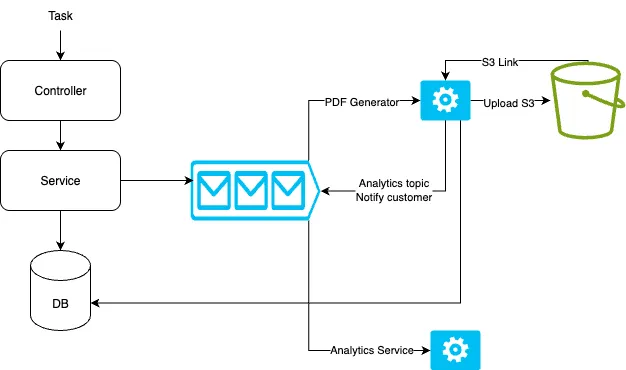

# Go Fiber REST API

A modern REST API built with Go Fiber framework, featuring hot reloading, containerization, and a complete development environment.

## Features

- 🚀 **Go Fiber** - Fast HTTP framework
- 🔥 **Hot Reloading** - Development with Air
- 🐳 **Docker** - Containerized development and production
- 🗄️ **MySQL 8** - Database
- 📦 **Redis** - Caching
- 🔍 **Redis Insight** - Redis GUI
- 📊 **Kafka** - Message broker
- 🎛️ **Kafka UI** - Kafka dashboard
- 🛠️ **Adminer** - Database management

## Architecture
High level overview: 

## Quick Start

### Prerequisites

- Docker & Docker Compose
- Go 1.25

### Development Environment

1. **Clone and start the development environment:**

   ```bash
   # Using Docker Compose directly
   docker-compose up --build
   ```

2. **Access the services:**
   - **API**: http://localhost:8080
   - **Redis Insight**: http://localhost:8001
   - **Kafka UI**: http://localhost:8080 (Note: conflicts with API, see note below)

> **Note**: Kafka UI and the API both use port 8080. To avoid conflicts, you can modify the Kafka UI port in `docker-compose.yml` to something like `8083:8080`.

## Available Commands

### Using Make

```bash
# Generate Migration
make migration-generate name=migration_name_that_want_to_generate #Generate migration
make migration-up        # Run the migration
make migration-down      # Revert the last migration
```

### Using Docker Compose directly

```bash
# Development
docker-compose up --build
docker-compose up --build -d  # detached mode

# Stop
docker-compose down

# Clean
docker compose down -v
```

## Environment Variables

You can find the list of environment variable inside .env.examples (automatically set in Docker Compose). 
Create a .env file in beside .env.example, set your environment variables then start docker container.

## Project Structure

```
.
├── .air.toml              # Air configuration for hot reloading
├── .gitignore             # Git ignore rules
├── Dockerfile             # Production Dockerfile
├── Dockerfile.dev         # Development Dockerfile with Air
├── docker-compose.yml     # Development environment
├── Makefile              # Convenient commands
├── go.mod                # Go modules
├── go.sum                # Go modules checksum
├── main.go               # Application entry point
├── scripts/
│   └── init.sql          # Database initialization
└── README.md             # This file
```

## Database Access

### MySQL Connection Details

- **Host**: localhost (when running locally) or mysql (within Docker network)
- **Port**: 3306
- **Username**: root
- **Password**: rootpassword
- **Database**: fiber_db

## Redis Access

### Redis Insight

1. Open http://localhost:8001
2. Add a new database with:
   - **Host**: redis (or localhost if accessing from outside Docker)
   - **Port**: 6379

### Command Line Access

```bash
# Connect to Redis CLI
make redis-cli

# Or using Docker directly
docker exec -it redis-cache redis-cli
```

## Kafka

### Kafka UI

Access the Kafka dashboard at http://localhost:8080 (you may need to change this port to avoid conflicts).

### Topics

You can create and manage Kafka topics through the UI or programmatically in your Go application.

## Hot Reloading

The development environment uses [Air](https://github.com/air-verse/air) for hot reloading. Any changes to your Go files will automatically rebuild and restart the application.

### Air Configuration

The `.air.toml` file contains the configuration for Air, including:

- File watching patterns
- Build commands
- Exclusion rules

## Troubleshooting

1. **Port Conflicts**: If you have services running on the same ports, modify the port mappings in the Docker Compose files.
2. **Volume Issues**: If you encounter volume-related issues, try `make clean` to remove volumes and restart.
3. **Hot Reloading Not Working**: Ensure your code changes are being saved and check the Air logs with `make logs-app`.

## Contributing

1. Fork the repository
2. Create a feature branch
3. Make your changes
4. Test with the development environment
5. Submit a pull request
